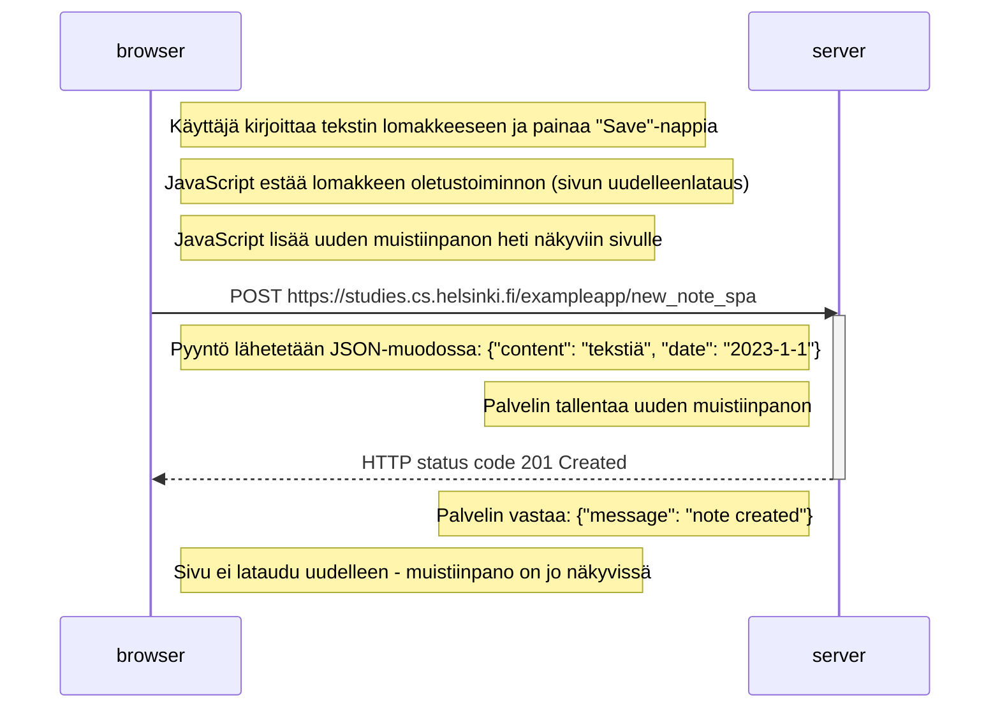

```mermaid
sequenceDiagram
    participant browser
    participant server
    
    Note right of browser: Käyttäjä kirjoittaa tekstin lomakkeeseen ja painaa "Save"-nappia
    
    Note right of browser: JavaScript estää lomakkeen oletustoiminnon (sivun uudelleenlataus)
    
    Note right of browser: JavaScript lisää uuden muistiinpanon heti näkyviin sivulle
    
    browser->>server: POST https://studies.cs.helsinki.fi/exampleapp/new_note_spa
    activate server
    Note right of browser: Pyyntö lähetetään JSON-muodossa: {"content": "tekstiä", "date": "2023-1-1"}
    Note left of server: Palvelin tallentaa uuden muistiinpanon
    server-->>browser: HTTP status code 201 Created
    deactivate server
    Note left of server: Palvelin vastaa: {"message": "note created"}
    
    Note right of browser: Sivu ei lataudu uudelleen - muistiinpano on jo näkyvissä
```